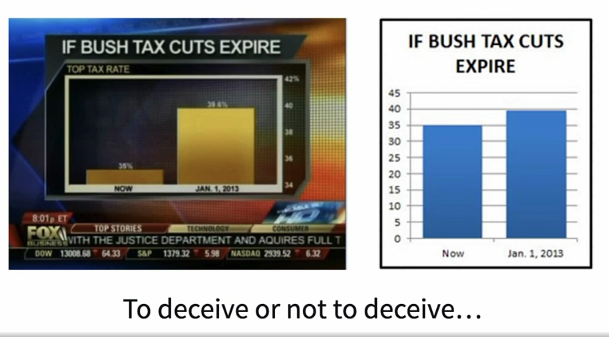
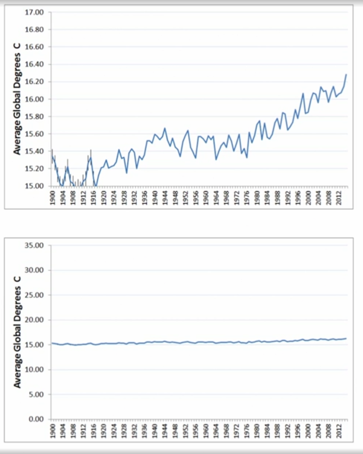
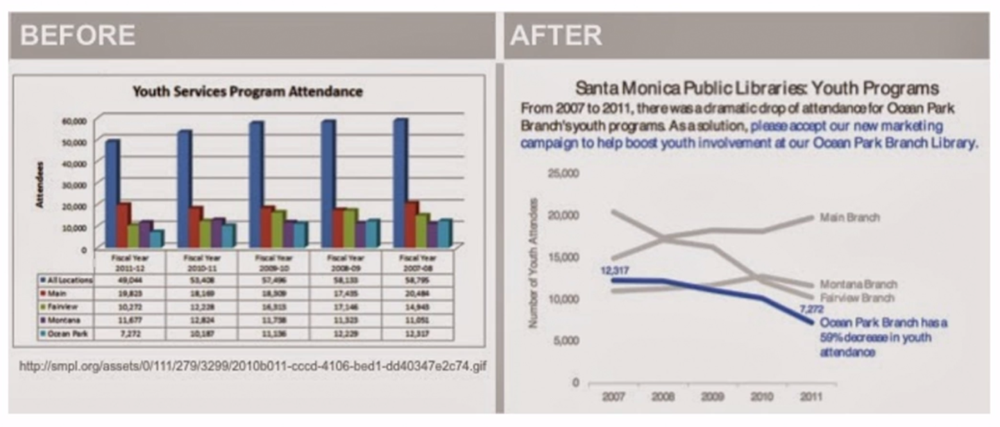

# Python for Data Analysis: Solve Real-World Challenges

- A study by Stanford's Professor, Chip Heath Chip Health found that 63% of people could remember stories while only 5% could remember statistics.
- Studies have shown that at least 75% of people are visual learners. We remember only 10% of what we read, 15% of what we hear and 75% of what we see.
- We have the unique ability to remember pictures with at least 90% accuracy.

## Visual best practices

#### Avoid diagonal elements
- This most commonly shows up in access labels and doing this makes some harder to read. 
- A study in 2005 found that reading rotated text at 45 degrees made it on average 52% slower for the audience to read than normally oriented text

#### Starting the axis at zero

##### 2 schools of thought

1. Darrell Huff, author of "How to Lie with Statistics" who thinks that starting the axis anywhere but zero leads to misinterpretation and is likely to be used to deceive the audience.

2. Edward Tufte, a pioneer in the field of data visualization, says that starting the axis at zero is a waste of vertical space.

When we include the zero axis, it looks much more stable. You'll need to use your best judgment based on the data you're visualizing and the story you're telling

#### Colour

- Use proper colour scale
- Use limited colours (three to five max)
- Use colours meaningfully and go beyond the decfault settings
- Use colour to highlight important information
- Provide sufficient contrast between colours
- Consider colour psychology and cultural association (E.g in Western culture red is used to depict something negative or bad. However, in India, red represents strength, bravery, and purity.)
- Utilise gray for supporting details and leverage white space
- Test fo colour blindness and black and white printing

#### Cognitive load

Focus on what you want your audience to get out of your visual, and try to use pre-attentive attributes like size, color, and position on a page to guide them, not confuse them.

- They've renamed the title and added a meaningful subtitle that also provides a clear recommendation and insight. 
- It has a more meaningful y-axis label, and it's removed the x-axis label to remove clutter, as it's obvious that those are years. 
- Iin the use of color, they've limited the number of colors to two, moving all supporting data points to a neutral gray, while highlighting the important parts of the graph in blue. 
- You can see the creative use of the gestalt principle in the line graph and the subtitle that relates Ocean Park in blue to Signal Similarity. 

##### The chart on the right objectively tells a better story than the one on the left. The left chart is informing the audience of the groups and their performance, while the right is communicating the story about Ocean Park branch.
 